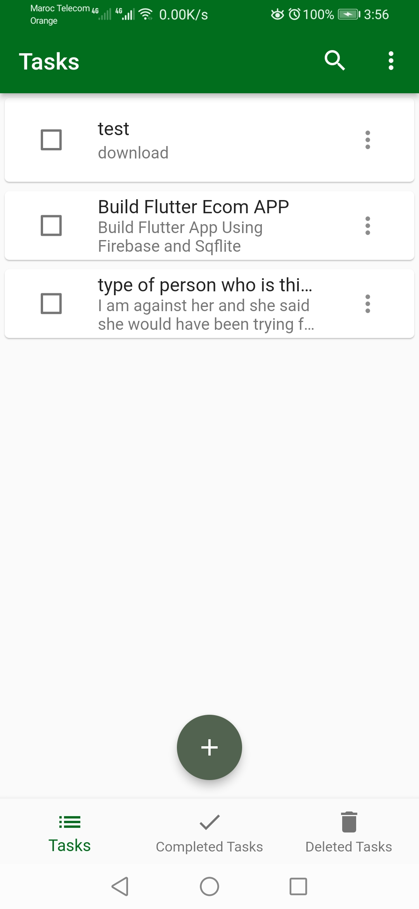

# Task Manager Flutter App

This is a task manager app built using Flutter. It allows users to create, view, delete, and complete tasks. The app uses Hive for local data storage and the Provider package for state management.

## Features

- Create new tasks with a title, description, and due date.
- View a list of tasks, including their title and description.
- Mark tasks as completed.
- Delete tasks.
- View deleted tasks and completed tasks separately.
- Edit existing tasks.
- Responsive UI design.

## Screenshots

## Installation

1. Clone the repository to your local machine.

2. Open the project in your preferred code editor.

3. Run the following command to install the dependencies: flutter pub get

4. Connect your device or emulator.

5. Run the app using the following command: flutter run

## Dependencies

- hive: 
- hive_flutter:
- path_provider:
- provider:

## Dev Dependencies

- hive_generator:
- build_runner:

## Usage

To use this app, follow these steps:

1. Open the app on your device or emulator.

2. Create a new task by tapping on the "+" button.

3. Fill in the task details such as title, description, and due date.

4. Save the task.

5. View the list of tasks on the home screen.

6. Tap on a task to view its details.

7. Mark a task as completed by tapping on the checkbox.

8. Delete a task by swiping it to the right.

9. Access the deleted tasks and completed tasks screens from the bottom navigation bar.

10. Edit a task by tapping on the edit icon.

11. Customize the app further by modifying the code to fit your requirements.

## License

This project is licensed under the [MIT License](LICENSE).

